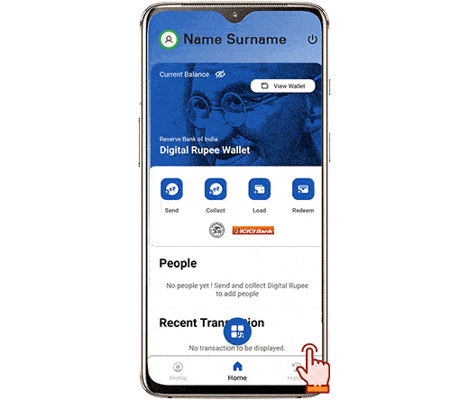

# Digital Rupee for AAM AADMI - Your money to be

Ever heard of the Digital Rupee? It's like your regular money, but in a smarter, digital avatar! And the good news is - it's the same but better! Let's dive into how this new avatar of digital money will transform Bharat's financial system.

## UPI is great! Why do we need digital rupee?

- **Digital Rupee** is a digital version of the Indian currency 'Rupee' launched by RBI. It's a digital alternative to cash, aimed at providing a secure and accessible means of conducting transactions. It's about creating digital 'money.'

- **UPI (Unified Payments Interface)**, on the other hand, is a platform that enables instant money transfer between bank accounts using a mobile phone. It's a system to 'move money' digitally, facilitating transactions, bill payments, and fund transfers between bank accounts.

In simple terms, Digital Rupee is about transforming the traditional rupee currency into a digital format for transactions, while UPI is a platform that enables seamless movement of money electronically between bank accounts.

Okay! So what difference does it make to me? 

## Exploring UPI and Digital Rupee: A Layman's Guide to Digital Transactions

Wondering how using UPI or digital rupee affects your daily transactions? You're not alone! For the average person, whether it's physical cash, UPI, or digital rupee, the difference might not be immediately apparent. But, this shift holds significant value for the government.

- **Cost Efficiency**: Let's talk about money matters! Handling physical cash can be very expensive for the government. Picture printing money, transporting it, and keeping it secure. According to the latest report by PwC on CBDC, just to handle INR 100 notes, around 15%–17% of the total expense over a four-year period is spent on various aspects like printing, distribution, and returning due to damage. As the use of physical cash grows, it burdens distribution and storage systems, as well as the environment due to its carbon footprint. The Digital Rupee, being all digital, cuts these costs since there's no need for printing or transportation, resulting in more efficient cost management.

## So, is Digital Rupee a *government authorized* cryptocurrency?
Cryptocurrencies burst onto the financial scene with a bold vision: to create an open and easily accessible financial world, free from traditional middlemen like banks. This movement, known as DeFi (Decentralized Finance), aimed to empower users with direct access to a spectrum of financial services, from lending to trading, all within their digital wallets. The goal was clear—promote financial inclusivity, break down entry barriers, and enhance control and transparency for users regarding their assets and transactions.

However, as cryptocurrencies gained immense popularity, the rapid acceptance and interest in these digital currencies posed a potential threat to the traditional intermediaries such as banks, and the government. While acknowledging the benefits of decentralization, they highlighted that cryptocurrencies were being hailed as an innovative force that could disrupt the conventional financial system.
The inherent design of cryptocurrencies seemed to challenge established and regulated financial structures crucial for the integrity and stability of the monetary and financial ecosystem. These digital assets were seen as potential disruptors, capable of undermining the country's financial and macroeconomic stability, particularly affecting the traditional financial sector. The proliferation of cryptocurrencies had the potential to reduce the authorities' capacity to shape and regulate monetary policies and the monetary system, posing a serious challenge to the stability of the nation's financial landscape.

In response, the central banks intervened and introduced the concept of CBDC (Central Bank Digital Currency). By distinguishing itself from the decentralized nature of cryptocurrencies, CBDC brought the government into the realm of blockchain technology. It marked a shift where the government could utilize blockchain to regulate transactions and continue ensuring economic stability within the country.

## How can I benefit from digital rupee as a consumer?
Looking ahead to a future where the Digital Rupee is a household name, the government envisions numerous advantages for the public:

- **Financial Inclusion**: Picture a world where everyone, including those in far-off places, can effortlessly use money through their phones or devices. The Digital Rupee strives for this vision—ensuring every citizen of India, no matter where they reside, can embrace the digital currency era.

- **Efficiency and Innovation**: Have you ever faced delays in getting your transactions sorted? The Digital Rupee aims to solve just that! It's created to be a more convenient and innovative way to handle your finances.

- **Cross-border Payments**: At times, we need to send or receive money from people in different countries. The Digital Rupee aims to simplify this process, making it quicker and more straightforward. It's about improving how we manage our funds across borders, ensuring smooth transactions globally.

- **Offline Transactions**: Ever found yourself in a place with no network or electricity when you needed to make a payment? The Digital Rupee steps in to assist during such times. It's geared to handle transactions even when you're offline, offering a solution for remote areas or situations with power outages. This way, you're never left without access to your funds!

## Alright! Can I get started and be part of the pilot with minimum amount?

1. **Select a Participating Bank:**
   - Choose from the designated banks involved in the e-rupee pilot program, which currently include State Bank of India, ICICI Bank, Yes Bank, IDFC First Bank, Bank of Baroda, Union Bank of India, HDFC Bank, and Kotak Mahindra Bank for the initial phase.

2. **Access the Official App or Website:**
   - Visit the official app or website of the selected bank to initiate the process.

3. **Register for e-rupee Wallet:**
   - Complete the registration process to set up your e-rupee wallet.

4. **Wait for Closed User Group (CUG) Invitation:**
   - Banks will notify you via SMS and email when you're selected to join the Closed User Group (CUG) for the e-rupee pilot program.

5. **Load Money into e₹-R Wallet:**
   - Load funds into your e₹-R wallet, which operates like a digital version of a physical wallet, using your linked bank account or various UPI apps.

## Using Digital Rupee (e₹-R) in India

Before using or making transactions with the digital rupee (e₹-R) pilot, keep the following in mind:

1. **e₹-R as an Electronic Token:**
   - The RBI issues retail digital rupee as an electronic token.

2. **Closed User Group (CUG):**
   - The e-rupee is distributed within a Closed User Group (CUG), which includes participating merchants and customers.

3. **Digital Wallet from Your Bank:**
   - Your bank will provide a digital wallet to facilitate online transactions of e-rupee on your smartphones or laptops.

4. **Person-to-Person (P2P) and Person-to-Merchant (P2M) Transactions:**
   - Use QR codes displayed at malls or shops for both person-to-person (P2P) and person-to-merchant (P2M) transactions.

5. **Features of Physical Cash:**
   - Despite being digital, e₹-R retains features of physical cash like safety, settlement finality, and trust.

6. **Conversion and Interest:**
   - You can convert e₹-R into other forms of money like bank deposits; however, it won't accumulate interest.

7. **Real-time Assessment and Future Evaluation:**
   - The e-rupee pilot program will evaluate the retail use, distribution, and stability of digital rupees in real-time. Based on this assessment, the RBI will consider various uses and aspects of the digital token.

# Appendix
## What is Fiat currency? And why did I never hear of it before?

**Fiat Currency:**
Fiat currency is a type of currency that is issued by a government and is not backed by a physical commodity like gold or silver. Instead, its value is derived from the trust and confidence of the people who use it. The government declares fiat currency to be legal tender, meaning it must be accepted as a form of payment within the country. Examples of fiat currencies include the US Dollar (USD), Euro (EUR), Japanese Yen (JPY), Indian Rupee (INR), and many others.

**Relationship Between Fiat Currency and CBDC (Central Bank Digital Currency):**
The central bank of a country typically issues both fiat currency and CBDC. The main difference is the form in which they exist:

1. **Fiat Currency:**
   - Traditional physical banknotes and coins, as well as electronic forms held in bank accounts, collectively constitute fiat currency. These physical and digital forms are issued and regulated by the central bank of a country.

2. **CBDC (Central Bank Digital Currency):**
   - CBDC is the digital form of a country's official fiat currency. It's issued and regulated by the central bank and operates on a blockchain or a similar digital ledger technology. CBDC maintains a direct link to the value and stability of the fiat currency it represents.

In essence, while fiat currency exists in both physical and digital forms, CBDC is exclusively digital, leveraging modern technologies like blockchain to represent the national currency. CBDC is essentially an extension of traditional fiat currency into the digital realm, offering benefits like increased efficiency, cost-effectiveness, and additional features, all while maintaining the value and stability associated with fiat.

