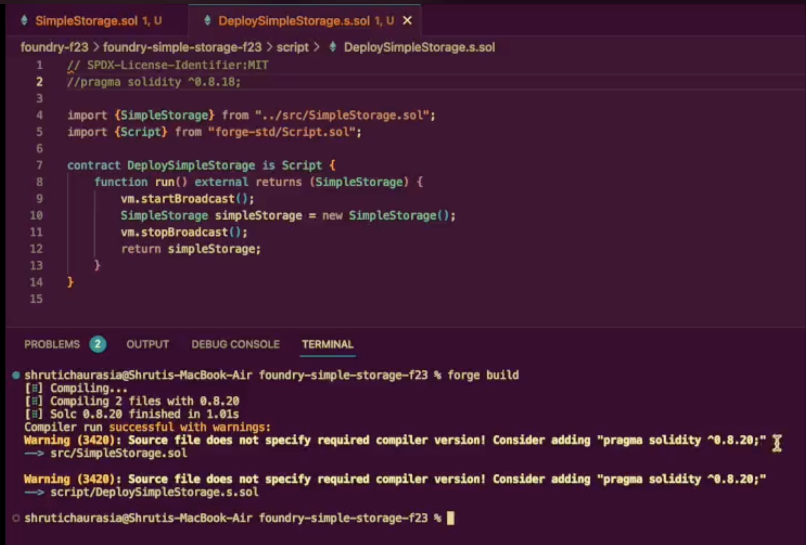

# Solidity Version in Contracts


Here's something I learnt about defining the solidity version for the contract:

```solidity
pragma solidity 0.8.21;
```

1. **Not defining Solidity version only creates a ⚠ warning, not an 🚫 error.** The compiler automatically picks the latest stable version to compile the contract.

2. **Using `^` for a higher version is similar to using `>=`.** For example:

```solidity
pragma solidity ^0.8.21;
```

is equivalent to:

```solidity
pragma solidity >=0.8.21;
```

3. **It is possible to define multiple Solidity versions. However, before the compiling task, the IDE installs the compilers listed in the smart contract. The last listed compiler overwrites any previously installed compilers.** For example:

```solidity
pragma solidity ^0.8.16;
pragma solidity 0.8.19;
```

In this case, the last installed compiler would be 0.8.19. The compiling begins at line 1, and since 0.8.18 fits in the range `^0.8.16`, the code will compile successfully.

But if the versions are listed the other way round:

```solidity
pragma solidity ^0.8.19;
pragma solidity 0.8.16;
```

The last installed version would be 0.8.16. When compiling begins at line 1, the compiler will try to match 0.8.20 with the installed compiler (0.8.16), and hence, throw a compiler version error.

🚫 Error (5333): Source file requires a different compiler version (current compiler is 0.8.16+commit.07a7930e.Darwin.appleclang) - note that nightly builds are considered to be strictly less than the released 
version.



PS: Correct me if I am wrong, still learning :) I appreciate your support.