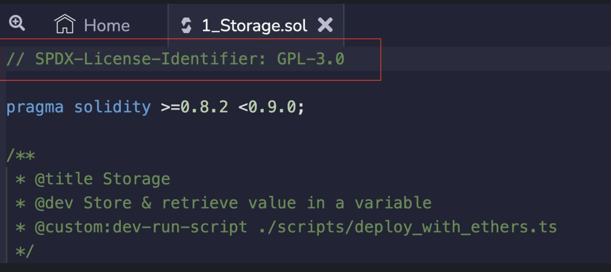

# SPDX License Identifier in Smart Contracts

## Introduction

To all Smart Contract Engineers,

We all have written this as the first line of comment in our smart contracts and never really asked ‘What is it’ and ‘Why’.

Last night while creating an educational video on Solidity, I decided to do some research, and thought this might be quite insightful for all of us:

```solidity
// SPDX-License-Identifier: MIT
```



## Understanding SPDX

SPDX stands for Software Package Data Exchange. It is a standard format for communicating the metadata that describes the contents of a software package.

## Purpose of SPDX

Why do we need to mention SPDX, even though it is a comment?

The SPDX standard ensures that the license under which the code is released is clearly specified and easily understood. This is particularly important for open-source software, where the licensing terms can have significant implications for how the software can be used and distributed. The SPDX-License-Identifier is a commonly used identifier in Solidity smart contracts that specifies the license under which the code is released.

## SPDX License Identifiers

But why MIT? Are there other licenses too?

There are currently more than 20 SPDX License Identifiers. The full list can be found at the [SPDX website](https://spdx.org/licenses/). The MIT license is a popular choice for many open-source projects because it is a permissive license that allows for the use, modification, and distribution of the software without many restrictions. Other common open-source licenses include the GNU General Public License (GPL), Apache License 2.0, and the BSD license. Ultimately, it's important to carefully consider the implications of each license and choose the one that best aligns with the goals of the project.

## Non-open Source Code

What if I do not want my code to be an open source?

If you do not want to specify a license or if the source code is not open-source, please use the special value `UNLICENSED`. Note that `UNLICENSED` (no usage allowed, not present in SPDX license list) is different from `UNLICENSE` (grants all rights to everyone).
